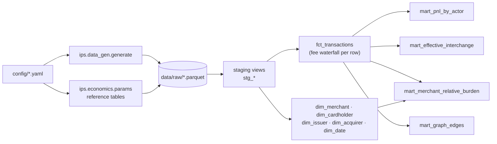
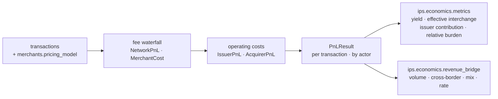
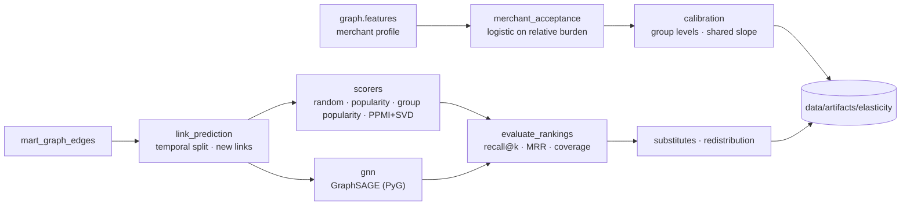

# Architecture

> Living document. Feature 2 added the data pipeline and Feature 3 the unit economics; later
> features add the graph, simulator, optimizer and app, and Feature 9 completes it for the
> README.

## Data pipeline (Feature 2)



Everything downstream of `data/raw/` lives in the DuckDB warehouse
(`data/warehouse/ips.duckdb`), built by dbt.

| Layer | Models | Materialisation | Purpose |
|---|---|---|---|
| Sources | `raw.*` (9 parquet files) | external | The generator's output and the reference tables, read in place |
| Staging | `stg_*` | view | Types and names, one view per source |
| Core | `fct_transactions`, `dim_*` | table | Facts with the network's fee waterfall applied per row; conformed dimensions |
| Marts | `mart_*` | table | Business-ready aggregates for economics, graph and simulator |

The reference tables (`mccs`, `interchange_table`, `network_fees`, `pricing_terms`) come from
`config/*.yaml` through `ips.economics.params`. The generator writes them, and
`python -m ips.tasks dbt` rewrites them before every build, so changing a fee never requires
regenerating the transactions.

## Unit economics (Feature 3)

The P&L of a purchase has two layers:

| Layer | What it contains | Where |
|---|---|---|
| **Fee waterfall** | Interchange, the network's fees on both sides (assessment, authorization, cross-border) and the MDR of the merchant's pricing model (blended or IC++). Issuer gross + network revenue + acquirer gross = MDR | `ips.economics.pnl` and `fct_transactions`, row by row |
| **Operating costs** | Rewards, grace-period funding, expected credit loss, processing and net fraud for the issuer; processing for the acquirer; chargebacks for the merchant. They turn each party's gross into its contribution | `ips.economics.pnl` |



- `compute_pnl(transactions, table, cfg)` takes the interchange table apart from the
  configuration, because it is the lever that scenarios and the optimizer will move.
- The metrics aggregate by any segment through `pnl_by`, so the notebooks and the simulator
  share one definition of each.
- The revenue bridge splits the change in network revenue between two periods or two
  scenarios with Shapley values: the effects add up exactly to the change and do not depend
  on the order of the drivers.
- `notebooks/02_unit_economics.ipynb` is the static dashboard of this layer.

## Merchant segmentation (Feature 4)

A separate layer that reads the warehouse and writes model artifacts, never the other way
round, so `dbt build` never depends on a model having run.

```mermaid
flowchart LR
    edges["mart_graph_edges"] --> graph["build_graph<br/>bipartite matrix · projection"]
    fct["fct_transactions · dim_merchant"] --> profile["features<br/>merchant profile"]
    graph --> embed["spectral_embed<br/>PPMI + truncated SVD"]
    profile --> baseline["baseline_kmeans<br/>tabular features"]
    embed --> clusters["clustering<br/>k-means, k by silhouette"]
    baseline --> clusters
    graph --> leiden["communities<br/>Leiden"]
    clusters --> evaluate["evaluate<br/>homogeneity · out-of-sample · interpretability"]
    leiden --> evaluate
    profile --> evaluate
    evaluate --> artifacts[("data/artifacts/segments")]
```

| Module | What it does |
|---|---|
| `build_graph.py` | Window, cardholder x merchant sparse matrix, merchant projection pruned to each card's habitual merchants |
| `features.py` | Merchant profile: attributes, customer mix and the two targets (effective interchange, relative burden) |
| `spectral_embed.py` | PPMI over the bipartite weights plus a truncated SVD — the matrix factorisation that random-walk embeddings approximate (Qiu et al., 2018) |
| `baseline_kmeans.py`, `clustering.py`, `communities.py` | The MCC-group benchmark and the unsupervised segmentations: attributes, embeddings, both together, and Leiden communities |
| `supervised.py` | Segments as the leaves of a regression tree over the business target, fitted on the training half only, each with the rule that defines it |
| `evaluate.py`, `segment_profiles.py` | The ladder, the shared train/test split, the marginal information of each representation, the verdict sentences and the business profile of each segment |
| `pipeline.py` | Orchestration; `python -m ips.tasks segment` writes the artifacts |

Everything is seeded from `config/base.yaml`: the same seed gives bit-identical embeddings and
labels.

Methods are compared on a ladder, and each rung answers a different objection:

| Rung | Method | What it answers |
|---|---|---|
| Benchmark | `mcc_group` | Does any of this beat leaving merchants in their own category? |
| Unsupervised | `baseline`, `graph`, `hybrid`, `leiden` | Which representation groups merchants best without looking at the target? |
| Supervised | `supervised`, `supervised_graph` | What is the best segmentation for the decision at hand? |

Two rules keep the ladder honest: every out-of-sample number comes from the same
`train_test_split`, and `marginal_information` measures what a representation adds with the
clustering step removed.

## Elasticity (Feature 5)

Two halves that meet in the simulator: **how much** volume walks away when a merchant's burden
rises, and **where** that volume goes. Like the segmentation, it reads the warehouse and writes
artifacts, never the other way round.



| Module | What it does |
|---|---|
| `params.py` | Re-exports the elasticity config models and derives each MCC group's sensitivity from `base_elasticity` |
| `merchant_acceptance.py` | The abandonment curve: a logistic on relative burden, with channel, surcharge, instant-payment and pricing-model modifiers |
| `calibration.py` | Nested bisection that solves one intercept per MCC group and a shared slope against two anchor figures, with group levels that scale with each group's median burden |
| `cardholder_response.py` | Log-linear spend response to a change in the rewards rate, by spend segment |
| `link_prediction.py` | Temporal split, new-link positives, the evaluation and its verdicts, merchant substitutes and volume redistribution |
| `scorers.py` | The rungs that need no neural network: random, popularity, popularity inside the cardholder's categories, PPMI+SVD |
| `gnn.py` | GraphSAGE over the bipartite graph with node attributes on both sides, trained single-threaded with early stopping |
| `pipeline.py` | Orchestration; `python -m ips.tasks elasticity` writes the artifacts |

Four rules keep the link-prediction ladder honest:

- **Time, not chance, separates training from evaluation.** The last `holdout_months` are held
  out, and a positive is a link that appears there for the first time. Repeat purchases are
  excluded, because predicting them is reading the history back.
- **Every method sees the same graph.** The cap on training cardholders applies before any
  method runs, and every method ranks the same candidates for the same cardholders.
- **Nothing is tuned on the held-out months.** GraphSAGE splits its training edges three ways —
  message passing, fitting and validation — and keeps the epoch with the best validation loss,
  stopping early when that loss stops improving or when the epoch budget runs out.
- **A lead has to survive the noise.** Every gap comes with a paired bootstrap interval over the
  evaluated cardholders; a gap whose interval crosses zero is reported as indistinguishable, not
  as a win.

The acceptance curve is not estimated: the data contains no abandonment events. It is a
structural assumption whose group levels and shared slope reproduce two anchor figures — both our
own until a published source replaces them — and its artifacts carry the anchors, each group's
level and the moments achieved. One intercept for the whole population is not enough: the slope
the second anchor demands then turns the curve into a threshold that leaves most groups with no
response to price.

`torch` and `torch-geometric` live in the `gnn` extra. Install torch from the CPU index first
(`pip install torch --index-url https://download.pytorch.org/whl/cpu`): the default Linux wheel
pulls the CUDA runtimes.

## Guarantees

- **P&L conservation** (`dbt/tests/assert_pnl_conservation.sql`, `tests/test_economics.py`):
  issuer gross + network revenue + acquirer gross equals the MDR in every row, in every mart,
  in every aggregation and in the totals, and network revenue equals the sum of its drivers.
  The dbt test also catches joins that duplicate rows.
- **Python and SQL agree** (`tests/test_pipeline.py`): on the sample, `fct_transactions`
  matches `ips.economics.pnl.compute_pnl` row by row on every waterfall column and network
  driver, and each mart matches its Python counterpart.
- **No hardcoded fees in SQL:** interchange, blended MDR, network fees and pricing terms
  arrive as raw tables generated from `config/*.yaml`.
- **Referential integrity:** `relationships` tests from the fact table to every dimension.
- **Volume conservation** (`tests/test_elasticity.py`): when merchants drop the card, the
  volume moved to their substitutes plus the volume that leaves the card rails equals the volume
  lost — including merchants with no substitute, whose whole volume counts as leakage.
- **No leakage in link prediction** (`tests/test_elasticity.py`): no held-out link appears in
  training, and GraphSAGE gives bit-identical vectors with the same seed.

## Running it

```text
python -m ips.tasks generate        # data/raw (use --sample for the small dataset)
python -m ips.tasks dbt             # reference tables from config, then dbt build
python -m ips.tasks docs --serve    # dbt docs with the lineage graph
python -m ips.tasks segment         # merchant segmentation and the comparison (Feature 4)
python -m ips.tasks elasticity      # acceptance curve and link-prediction ladder (Feature 5)
python -m ips.tasks test            # pytest + ruff
python -m ips.tasks all             # generate, dbt and test, in order
```

`make <task>` does the same on Linux and CI.

The runner passes absolute paths to dbt through `IPS_RAW_DIR` and `IPS_WAREHOUSE`, so dbt
never depends on the working directory.

DuckDB lets one process write the warehouse or several read it, never both at once. Close
notebooks that have it open before running `dbt build`.

## Moving to another warehouse

The models are plain SQL over `ref()` and `source()`. To target Snowflake, add a Snowflake
output to `dbt/profiles.yml` and point the `raw` source at the loaded tables instead of the
parquet files; the staging, core and mart models do not change.
