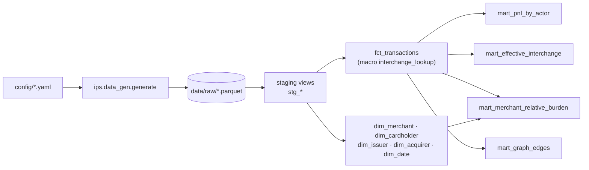

# Architecture

> Living document. Feature 2 adds the data pipeline; later features add the graph,
> simulator, optimizer and app, and Feature 9 completes it for the README.

## Data pipeline (Feature 2)



Everything downstream of `data/raw/` lives in the DuckDB warehouse
(`data/warehouse/ips.duckdb`), built by dbt.

| Layer | Models | Materialisation | Purpose |
|---|---|---|---|
| Sources | `raw.*` (8 parquet files) | external | The generator's output, read in place |
| Staging | `stg_*` | view | Types and names, one view per source |
| Core | `fct_transactions`, `dim_*` | table | Facts with the network's fees applied per row; conformed dimensions |
| Marts | `mart_*` | table | Business-ready aggregates for economics, graph and simulator |

## Guarantees

- **P&L conservation** (`dbt/tests/assert_pnl_conservation.sql`): interchange + scheme fee +
  acquirer margin equals the MDR in every row, in every mart and in the totals. The same
  test also catches joins that duplicate rows.
- **Python and SQL agree** (`tests/test_pipeline.py`): on the sample, `fct_transactions`
  matches `ips.economics.simple_pnl.compute_pnl` row by row, and each mart matches its
  Python counterpart.
- **No hardcoded fees in SQL:** interchange, blended MDR and the scheme fee arrive as raw
  tables generated from `config/*.yaml`.
- **Referential integrity:** `relationships` tests from the fact table to every dimension.

## Running it

```text
python -m ips.tasks generate        # data/raw (use --sample for the small dataset)
python -m ips.tasks dbt             # dbt build: models + tests
python -m ips.tasks docs --serve    # dbt docs with the lineage graph
python -m ips.tasks test            # pytest + ruff
python -m ips.tasks all             # the three above, in order
```

`make <task>` does the same on Linux and CI.

The runner passes absolute paths to dbt through `IPS_RAW_DIR` and `IPS_WAREHOUSE`, so dbt
never depends on the working directory.

DuckDB lets one process write the warehouse or several read it, never both at once. Close
notebooks that have it open before running `dbt build`.

## Moving to another warehouse

The models are plain SQL over `ref()` and `source()`. To target Snowflake, add a Snowflake
output to `dbt/profiles.yml` and point the `raw` source at the loaded tables instead of the
parquet files; the staging, core and mart models do not change.
